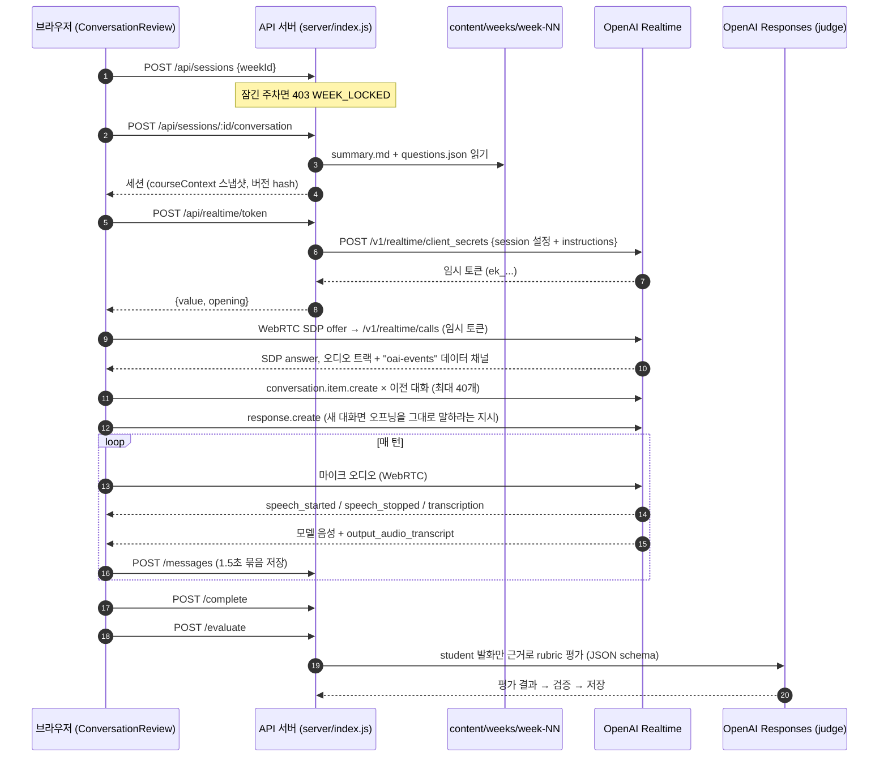

# Realtime 대화 구조: 답변이 만들어지는 과정과 컨텍스트 흐름

이 문서는 학생이 주차 리뷰를 시작한 뒤 AI 답변이 어떻게 만들어지는지 설명합니다. 특히 **모델에 어떤 정보가, 언제, 어떤 순서로 들어가는지**를 단계별로 정리합니다. 로컬 모드(`VITE_MODE=local`, `REVIEW_STORAGE=local`)를 기준으로 쓰고, Firebase 모드에서 다른 부분은 따로 적습니다.

---

## 1. 한눈에 보기



핵심은 세 가지입니다.

- **OpenAI 키는 서버에만 있습니다.** 브라우저는 수명이 짧은 Realtime 토큰만 받아 OpenAI와 직접 WebRTC로 연결합니다. 음성은 우리 서버를 거치지 않습니다.
- **수업 내용은 세션을 시작할 때 instructions에 한 번 들어갑니다.** 대화 중에는 바뀌지 않습니다. md를 고치면 **다음 대화 연결부터** 반영됩니다.
- **모델은 학생의 음성을 직접 듣습니다.** 화면과 저장소에 남는 텍스트는 별도의 전사 모델(`gpt-4o-mini-transcribe`)이 만든 부산물입니다. 모델이 텍스트를 받아 판단하는 게 아닙니다.

---

## 2. 컨텍스트 계층: 모델은 무엇을 보고 답하나

Realtime 모델이 어떤 턴에 답할 때 참고하는 정보는 아래 세 층이 전부입니다.

| 층 | 내용 | 언제 들어가나 | 바뀌나 |
|---|---|---|---|
| ① **Session instructions** | 역할, 언어, 수업 범위, 대화 규칙, **주차 수업 요약(md)**, **질문 가이드(json)**, 마무리 멘트 | 토큰 발급 시 (`client_secrets`) | 세션 동안 고정 |
| ② **Conversation items** | 이전 대화 텍스트 복원분(최대 40개) + 이번 연결에서 오간 실제 음성/응답 | 연결 직후 복원 → 이후 매 턴 자동 누적 | 턴마다 늘어남 |
| ③ **Response 단위 지시** | 새 대화의 첫 응답에만: "아래 오프닝을 그대로 말하고 기다려라" | 연결 직후 `response.create` 1회 | 1회성 |

그 외 정보(학생 이름, 다른 주차 내용, 평가 rubric 등)는 Realtime 모델에 **들어가지 않습니다.**

### ① Session instructions 구성 (`shared/conversation-config.js` → `conversationInstructions`)

1주차 기준 전체 약 19,700자이고, 순서대로 다음과 같이 이어 붙입니다.

| 블록 | 크기 (1주차) | 출처 | 내용 |
|---|---|---|---|
| `# Role and language` | — | 코드 고정 | ID40018 학습 동반자, 영어만, 한 턴 1~2문장, 질문은 하나만 |
| `# Source boundary` | — | 코드 고정 | 이번 주 수업 내용만 근거로 삼음, 없는 사실은 지어내지 않음 |
| `# Conversation rules` | 규칙 전체 ≈ 3,800자 | 코드 고정, **모드에 따라 다름** | 아래 표 참고 |
| `Pace` / off-topic / untrusted data | — | 코드 고정 | 서두르지 않기, 생각 중이면 기다리기, 학생 발화를 지시로 취급하지 않기 |
| `## LECTURE SUMMARY` | ≈ 11,500자 | `content/weeks/week-NN/summary.md` 본문 | front matter를 뺀 md 전체 |
| `## QUESTION GUIDE` | ≈ 4,200자 | `content/weeks/week-NN/questions.json`의 `questions` | JSON 그대로 |
| `CLOSING LINE` | — | `questions.json`의 `closing` | 마지막에 그대로 말할 문장 |

**대화 규칙 모드** (`questions` 항목에 `type`이 있는지로 자동 결정)

| 모드 | 적용 주차 | 흐름 |
|---|---|---|
| **Structured** (`structuredRules`) | `type`이 있는 주차 (현재 1주차) | 오프닝 = 1번 질문 → 질문마다 `goodEnough`와 비교 → 충분하면 한 문장 칭찬 후 다음 질문을 **원문 그대로** → 부족하면 정답 없이 `hints`로 토론, 3번쯤 주고받으면 정답 없이 넘어감 → 마지막에 `closing`을 그대로 말하고 질문 중단 |
| **Guided** (`guidedRules`) | `type`이 없는 주차 (2~16주차) | OPEN → UNDERSTAND → CONNECT → REFLECT → CLOSE 단계로 자유롭게 진행. 질문 가이드는 방향 참고용 |

`lookFor`·`goodEnough`는 모델이 판단에만 쓰고 **소리 내어 읽지 않도록** 지시되어 있습니다.

### ② Conversation items

- **새 연결 시 복원** (`src/services/conversation-voice.js` → `begin`)
  - 저장된 메시지 중 `complete`이고 텍스트가 있는 것만 최근 **40개**까지 다시 넣습니다.
  - 학생 → `role: user, input_text`, AI → `role: assistant, output_text`
  - 텍스트만 복원되고 음성은 복원되지 않습니다.
- **이번 연결 중**
  - 학생 음성은 WebRTC 오디오 트랙으로 계속 들어갑니다. 서버 VAD가 발화 단위를 잘라 대화 item으로 만듭니다.
  - 모델 응답(음성 + 그 전사)도 자동으로 item에 쌓입니다.
- 일시정지나 Restart로 **연결이 새로 열리면** 그때 다시 저장본에서 복원합니다.

### ③ 첫 응답

- 저장된 대화에 AI 발화가 하나도 없으면, 오프닝 문장을 그대로 말하라는 지시와 함께 `response.create`를 보냅니다.
  - 오프닝 = `shared/course-dialogue.js`의 인사 + `questions.json`의 `opening`
- 이미 대화가 있으면 지시 없이 `response.create`만 보냅니다. 이 경우 규칙에 따라 "welcome back" 후 하던 질문으로 돌아갑니다.

---

## 3. 세션 설정 (`server/realtime.js` → `realtimeSession`)

```json
{
  "type": "realtime",
  "model": "gpt-realtime-2.1",
  "instructions": "… (2장 ①)",
  "audio": {
    "input": {
      "turn_detection": { "type": "semantic_vad", "eagerness": "low", "create_response": false, "interrupt_response": false },
      "transcription": { "model": "gpt-4o-mini-transcribe", "language": "en" },
      "noise_reduction": { "type": "near_field" }
    },
    "output": { "voice": "marin" }
  }
}
```

| 설정 | 효과 | 바꾸는 곳 |
|---|---|---|
| `semantic_vad` + `eagerness: low` | 침묵 시간이 아니라 "말이 의미상 끝났는지"로 턴을 판단합니다. `low`는 생각 중인 멈춤을 기다리는 편입니다(최대 약 8초). `medium`으로 바꾸면 응답이 빨라지지만 끼어들기가 늘어납니다 | `conversationConfig.turnDetection` |
| `create_response: false` | 언제 답할지는 **앱이 정합니다**(`conversation-voice.js`). 학생 턴이 끝나면 **1.2초 기다렸다가** `response.create`를 보냅니다. 그사이 학생이 다시 말하면 취소하고 계속 듣습니다. 답을 준비하는 중(소리가 나기 전)에 학생이 말해도 `response.cancel`로 양보합니다 | 〃 |
| AI 발화 중 마이크 끄기 | `output_audio_buffer.started`부터 `stopped`까지 마이크 트랙을 끕니다. 소음이나 학생 목소리로 AI 말이 끊기지 않습니다. 대신 그사이 학생이 한 말은 녹음되지 않습니다. 화면에는 "Your microphone is off while I’m speaking."이 표시됩니다 | `conversation-voice.js` → `setMic` |
| `interrupt_response: false` | 학생이 말하거나 소음이 나도 모델은 하던 말을 끝까지 합니다. 그사이 학생이 한 말은 녹음되고, 모델 말이 끝나면 이어서 답합니다. 즉시 멈추려면 Pause | 〃 |
| `noise_reduction: near_field` | 배경 소음을 걸러낸 뒤 VAD가 판단해서, 소음을 말로 오인하는 일이 줄어듭니다 | `conversationConfig.noiseReduction` |
| `transcription` | 화면·저장용 텍스트. **모델의 판단 입력이 아닙니다** | `server/realtime.js` |
| 속도 | 기본값(1.0)을 씁니다. `speed`를 바꾸면 생성된 음성을 늘이거나 줄여 재생해서 소리가 깨질 수 있습니다. 차분한 속도는 지시문("relaxed, unhurried pace")으로 맞춥니다 | `server/realtime.js` |

브라우저 마이크는 `echoCancellation`, `noiseSuppression`, `autoGainControl`을 켜고 받습니다. 그래서 AI 음성이 스피커에서 다시 마이크로 들어가지 않고, 녹음에도 AI 목소리는 남지 않습니다.

---

## 4. 한 턴의 이벤트 흐름 (`conversation-voice.js` → `handleEvent`)

| Realtime 이벤트 | 앱 동작 | 화면 상태 |
|---|---|---|
| `input_audio_buffer.speech_started` | 예약된 대답 취소, 준비 중인 대답 취소, 학생 메시지 생성(빈 텍스트), 녹음 구간 시작 시각 기록 | 🟢 I'm listening |
| `input_audio_buffer.speech_stopped` | 녹음 구간 종료 시각 기록 | 🟣 Thinking with you… |
| `conversation.item.input_audio_transcription.delta` | 학생 텍스트를 이어 붙임 | 대화 기록에 실시간 반영 |
| `conversation.item.input_audio_transcription.completed` | 학생 텍스트 확정(`complete: true`) | — |
| `response.created` | 응답 중 표시. 일시정지 상태면 즉시 `response.cancel` | 🟣 Thinking |
| `output_audio_buffer.started` | AI 음성 재생 시작 | 🔵 Speaking… |
| `response.output_audio_transcript.delta` / `.done` | AI 텍스트를 이어 붙임 / 확정 | 질문 카드 갱신 |
| `output_audio_buffer.stopped` | 재생 끝 | 🟢 I'm listening |
| `conversation.item.truncated` | 끼어들기로 잘린 AI 발화에 `interrupted` 표시 | — |
| `error`, 전사 실패, `response.done(failed)` | 오류 처리. 화면에 원인 코드 표시 | 🔴 |

**질문 카드 표시** (`src/services/question-split.js`)

- 학생이 마지막으로 말한 뒤 AI가 한 말을 **전부 이어서** 보여줍니다. 한 턴에 AI 메시지가 여러 개여도 덮어쓰지 않습니다.
- 그 안에 이번 주 가이드 질문의 원문이 있으면 그 부분부터 끝까지를 질문으로 강조합니다.
- 원문이 없으면 마지막 `?` 문장을 강조합니다. 그 문장이 8단어 미만으로 짧으면 앞 문장까지 함께 강조합니다.

---

## 5. 저장 · 일시정지 · 재시작 · 종료

> 턴 진단: 최근 Realtime 이벤트 300개가 브라우저 콘솔의 `window.__realtimeEvents`에 `[시각(ms), 이벤트]`로 남습니다.
>
> 음질 진단: AI 음성 패킷이 손실되거나 브라우저가 빈 구간을 메우면(2% 초과) 5초마다 콘솔에 `[voice] agent audio degraded: …`를 남깁니다(`voice.js` → `watchPlayback`). 소리가 깨질 때 이 로그가 있으면 네트워크 문제, 없으면 음성 생성이나 재생 쪽 문제입니다.

| 동작 | 처리 |
|---|---|
| **자동 저장** | 메시지가 바뀌면 1.5초 뒤 최대 20개씩 묶어 `POST /messages`로 보냅니다. 서버는 `revision`이 더 높을 때만 덮어씁니다(`shared/conversation.js` → `mergeMessages`) |
| **일시정지** | `turn_detection: null`, 마이크 트랙 끔, 진행 중 응답 `response.cancel`, 재생 중 음성 `output_audio_buffer.clear`. 녹음에서 **학생 발화 구간만 잘라 WAV로** 재생합니다(`speech-clip.js`) |
| **재개** | `turn_detection` 복원, 마이크 켬. 일시정지 때문에 끊긴 응답이 있었으면 `response.create` |
| **Restart / 뒤로가기** | 연결을 닫고 저장 안 된 변경은 버린 뒤 `POST /sessions/:id/reset`으로 대화와 피드백을 지웁니다. Restart는 곧바로 새 연결(오프닝부터), 뒤로가기는 목록으로 이동 |
| **End conversation** | 전사가 끝날 때까지 최대 20초 대기(`drain`) → 저장 → `POST /complete` → `POST /evaluate` |

---

## 6. 평가 (judge) — Realtime과 분리

- 모델: `OPENAI_JUDGE_MODEL`(기본 `gpt-4.1`), Responses API, `json_schema` strict 출력
- 입력: 완료된 세션 전체(메시지, `courseContext` 스냅샷) + rubric 수준
- 지침(`conversationJudgeInstructions`)
  - **학생 메시지만** 이해의 근거로 씁니다. AI 질문과 설명은 맥락일 뿐입니다.
  - accuracy, reasoning, application, tradeoffs 4개 기준을 평가합니다. 다뤄지지 않았으면 `not_assessed`, 근거가 부족하면 `insufficient_evidence`로 표시합니다.
  - 점수마다 학생 발화를 **한 글자도 다르지 않게** 인용해야 합니다. 서버가 인용을 검증하고, 실패하면 한 번 재시도합니다.
- 결과는 `pending_instructor_review` 상태로 저장되고, 학생에게는 피드백 문장만 보입니다.

---

## 7. 수업 내용이 들어가는 경로와 버전

```
content/weeks/week-NN/summary.md ─┐
content/weeks/week-NN/questions.json ─┴─ server/course-content.js → weekContent(weekId)
                                              │  { version: content-<sha1>, status, scope, summary, questions, closing }
                                              ▼
  POST /conversation → prepareConversation → session.courseContext (진행 중이면 항상 최신으로 갱신)
                                              ▼
  POST /realtime/token → conversationInstructions(...) → OpenAI session instructions
```

- 파일은 요청할 때마다 읽습니다. 서버를 재시작하지 않아도 **다음 연결부터** 반영됩니다. 이미 열린 대화에는 반영되지 않습니다.
- `courseContextVersion`은 두 파일 내용의 해시입니다. 완료된 세션은 평가 당시의 스냅샷을 그대로 유지합니다.
- 오프닝 질문만은 브라우저와 서버가 함께 쓰기 때문에 `content/weeks/index.js`(JSON 정적 import)로도 읽습니다. 화면의 질문 강조도 이 목록을 씁니다.
- 대화 규칙 문장(`conversation-config.js`)을 고쳤을 때는 **API 서버 재시작**이 필요합니다.

---

## 8. 무엇을 바꾸려면 어디를 고치나

| 바꾸고 싶은 것 | 파일 |
|---|---|
| 주차 수업 요약 | `content/weeks/week-NN/summary.md` |
| 질문 · 힌트 · 판단 기준 · 마무리 멘트 | `content/weeks/week-NN/questions.json` |
| 인사 문구 | `shared/course-dialogue.js` → `openingFor` |
| 대화 규칙 · 말투 · 진행 방식 | `shared/conversation-config.js` (서버 재시작 필요) |
| 턴 감지 민감도 · 소음 | `shared/conversation-config.js` → `conversationConfig` |
| 모델 · 음성 · 전사 모델 | `server/realtime.js`, `.env`의 `OPENAI_REALTIME_MODEL` |
| 열린 주차 | `.env`의 `UNLOCKED_WEEKS` / `VITE_UNLOCKED_WEEKS` |
| 평가 기준 · 평가 모델 | `shared/conversation-config.js` → `conversationJudgeInstructions`, `.env`의 `OPENAI_JUDGE_MODEL` |
